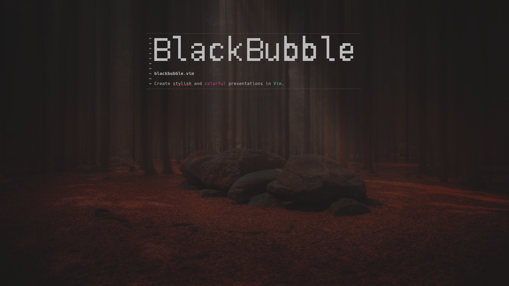

# blackbubble

_Very simple Vim plugin for creating presentations_

---

`blackbubble` uses Vim folds to create "slides", and ad-hoc syntax highlighting to make presentations stand out.
It can also use [toilet](https://github.com/cacalabs/toilet) to create larger texts and borders.
[goyo.vim](https://github.com/junegunn/goyo.vim) is a great plugin that will make blackbubble presentations look much better.

A presentation consists of a single file with the `.bbb` extension.
Every paragraph is a slide.
Empty lines separate paragraphs.

Syntax rules are saved in a `.vim` file in the same directory, which is then sourced every time the presentation file is opened.

### Installation

`vim-plug`:

+ Add `Plug 'https://github.com/limaara/blackbubble'` to your vimrc
+ Run `:PlugInstall`

### Dependencies

+ `toilet` (optional)

### Shortcuts

| Key Combination        | Action                                                     |
| :--------------------- | --------------------------------------:                    |
| `<Leader><Leader>`     | Start presentation on the current slide                    |
| `<Leader><Right>`      | Next slide                                                 |
| `<Leader><Left>`       | Previous slide                                             |
| `<Leader>t1`           | Create a big title from the current line (uses `toilet`)   |
| `<Leader>t2`           | Create a small title from the current line (uses `toilet`) |
| `<Leader>t3`           | Create a fancy title from the current line (uses `toilet`) |
| `<Leader>b1`           | Draw borders around the current line (uses `toilet`)       |
| `<Leader>co`           | Colorize the current word                                  |
| `<Leader>em`           | Emphasize the current word                                 |
| `<Leader>it`           | Italicize the current word                                 |
| `<Leader>ul`           | Underline the current word                                 |
